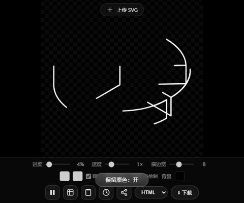

# SVG Animation Generator

上传 SVG → 描边逐笔画出的动画 / 粒子飞入聚合动画。双栏 UI：顶部配置、底部播放。



## 快速开始

```bash
npm install
npm run dev        # 开发模式，热更新
npm run build      # 输出 dist/index.html，双击即用
npm test           # 运行 149 项单元测试
```

直接使用：打开 [dist/index.html](dist/index.html)，拖入 `dist/svg/` 下的示例 SVG。

## 完整功能

| 分类 | 功能 | 说明 |
|------|------|------|
| **动画** | 描边逐笔绘制 | stroke-dasharray 动画，所有路径一笔笔画出来 |
| | 粒子飞入聚合 | 粒子从四周飞入聚合为完整图形 |
| | 逐条绘制 | 路径一根接一根画，间隔可调（0.5×–3×） |
| | 速度控制 | 0.25×–4× 变速播放 |
| | 保留/消退描边 | 动画结束后描边保留或淡出 |
| | 缓动曲线 | 线性 / 缓入 / 缓出 / 缓入缓出 |
| | 动画预设 | ⚡快速 / ▶标准 / 🎬电影 一键切换参数 |
| **颜色** | 描边色 & 填色 | 独立取色器 |
| | 颜色同步 | 填色跟随描边或独立设置 |
| | 保留原色 | 恢复 SVG 原始配色 |
| | 背景色 | 预览区背景颜色 |
| **图层** | 独立开关 | 每条路径单独控制可见性 |
| | 逐路径颜色 | 图层面板里给每条路径单独调色 |
| | 拖动画板 | 图层面板支持鼠标和触摸拖动 |
| | 重置颜色 | 一键清除所有自定义路径颜色 |
| **导出** | HTML | 完整动画网页，双击即用 |
| | SVG | 当前画面快照 |
| | PNG / JPG | 当前画面截图 |
| | WebM 视频 | 粒子动画录制（MediaRecorder） |
| **交互** | 时间轴 | 拖拽跳转，键盘 ← → 逐帧微调（Shift 加速） |
| | 自动恢复 | 键盘操作后 800ms 无操作自动恢复播放 |
| | 撤销/重做 | Ctrl+Z 撤销，Ctrl+Y 重做，50 步历史 |
| | 亮色/暗色主题 | ☀/🌙 一键切换，刷新保持 |
| | 拖放上传 | 直接拖 SVG 文件到预览区 |
| | 粘贴 SVG | 粘贴 SVG 代码 |

## 架构

经过 5 次架构升级，模块间通过事件总线通信，松耦合、可扩展：

```
controls.ts ──emit──▶ EventBus ──on──▶ animator.ts
  (UI 交互)           (events.ts)      (RAF 调度)
                       ▲    ▲
                  on   │    │  on
       stroke-engine.ts    particles.ts
       (描边动画引擎)       (粒子动画引擎)
```

### 核心注册机制

| 机制 | 文件 | 说明 |
|------|------|------|
| **控件注册** | `core/control-registry.ts` | 声明式注册控件 → 自动 DOM 绑定。加新控件 = 1 行 `registerControl()` |
| **引擎注册** | `core/engine-registry.ts` | 引擎实现 AnimationEngine 接口 → `registerEngine()` → `switchEngine()` 切换 |
| **事件总线** | `core/events.ts` | 18 种标准事件，模块松耦合通信。加新功能只需监听已有事件 |
| **CSS 主题** | `core/themes.ts` + `style.css` | CSS 自定义属性驱动，`data-theme="dark\|light"` 一键切换，localStorage 持久化 |
| **命令/撤销** | `core/commands.ts` | 所有操作包装为 Command → UndoManager 管理 undo/redo。Ctrl+Z 撤销，Ctrl+Y 重做，栈顶 50 |

### 动画引擎

引擎实现统一的 `AnimationEngine` 接口（`init` / `tick` / `render` / `destroy`），由注册中心管理，RAF 调度器统一驱动。加新动画类型只需实现接口 + 注册。

| 引擎 | ID | 说明 |
|------|-----|------|
| `strokeEngine` | `stroke` | stroke-dasharray 描边动画 + fill 淡入 |
| `particleEngine` | `particle` | 粒子从四周飞入聚合 |

## 项目结构

```
src/
├── core/              # 核心引擎
│   ├── events.ts      # 事件总线（EventBus + 16 种标准事件）
│   ├── engine-registry.ts  # 动画引擎注册中心
│   ├── control-registry.ts # 控件注册中心
│   ├── parser.ts      # SVG 解析（fill 处理、嵌套组、6种几何标签）
│   ├── renderer.ts    # DOM 构建（measureAndCache、sortByArea、createElementPair）
│   ├── animator.ts    # RAF 调度器（每帧委托 activeEngine.tick/render）
│   ├── commands.ts    # 命令模式 + UndoManager（Ctrl+Z/Y 撤销重做）
│   ├── themes.ts      # 主题管理（CSS 变量切换，localStorage 持久化）
│   └── particles.ts   # 粒子动画引擎 + 粒子渲染函数
├── engines/           # 动画引擎实现
│   └── stroke-engine.ts  # 描边动画引擎（updateElements、updateColors）
├── ui/                # 界面层
│   └── controls.ts    # 所有事件绑定 & 图层面板逻辑
├── export/            # 导出
│   └── exporter.ts    # HTML 动画 / SVG 快照 / PNG / JPG / WebM
├── state/             # 状态管理
│   ├── store.ts       # 全局状态（30+ 变量）+ 常量
│   └── types.ts       # TypeScript 类型定义
├── utils/             # 工具
│   └── helpers.ts     # escHtml / hexToRgb / parseColor / applyEasing / withTempSVG
├── main.ts            # 入口
└── style.css          # 样式
```

## 测试

```bash
npm test              # vitest + jsdom，149 项测试
```

```
tests/
├── parser.test.ts    # SVG 解析（fill 边界、嵌套组、style、6种标签）
├── utils.test.ts     # 工具函数（escHtml / hexToRgb / applyEasing / parseColor）
├── state.test.ts     # 状态计算（totalCycle / perElemStrokeDur / elementCycle）
├── renderer.test.ts  # DOM 构建（createElementPair）
├── animator.test.ts  # 动画引擎（描边/消退/逐条/保留原色/customFills）
├── exporter.test.ts  # 快照（SVG 有效性、背景、样式）
├── ui.test.ts        # UI 层（图层列表、颜色显示、preserve 模式）
├── edge.test.ts      # 边界情况（updateColors / sortByArea mock / 嵌套组）
├── events.test.ts    # 事件总线（on/once/off/emit/removeAll/错误隔离/集成）
├── registry.test.ts  # 注册中心（控件绑定/引擎切换/事件发射）
└── commands.test.ts  # 命令模式（undo/redo/属性命令/回调命令/组合命令/栈上限）
```

## 技术栈

- TypeScript（strict mode，0 错误）
- Vite + vite-plugin-singlefile → 构建为单 HTML
- Vitest + jsdom → 单元测试
- Husky → pre-commit 自动跑测试
- SVG stroke-dasharray 动画
- Canvas 2D 粒子动画
- EventBus 松耦合架构
- 零框架依赖
